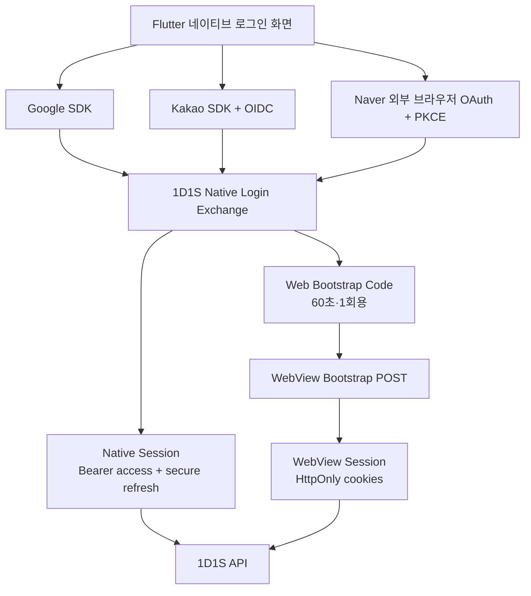
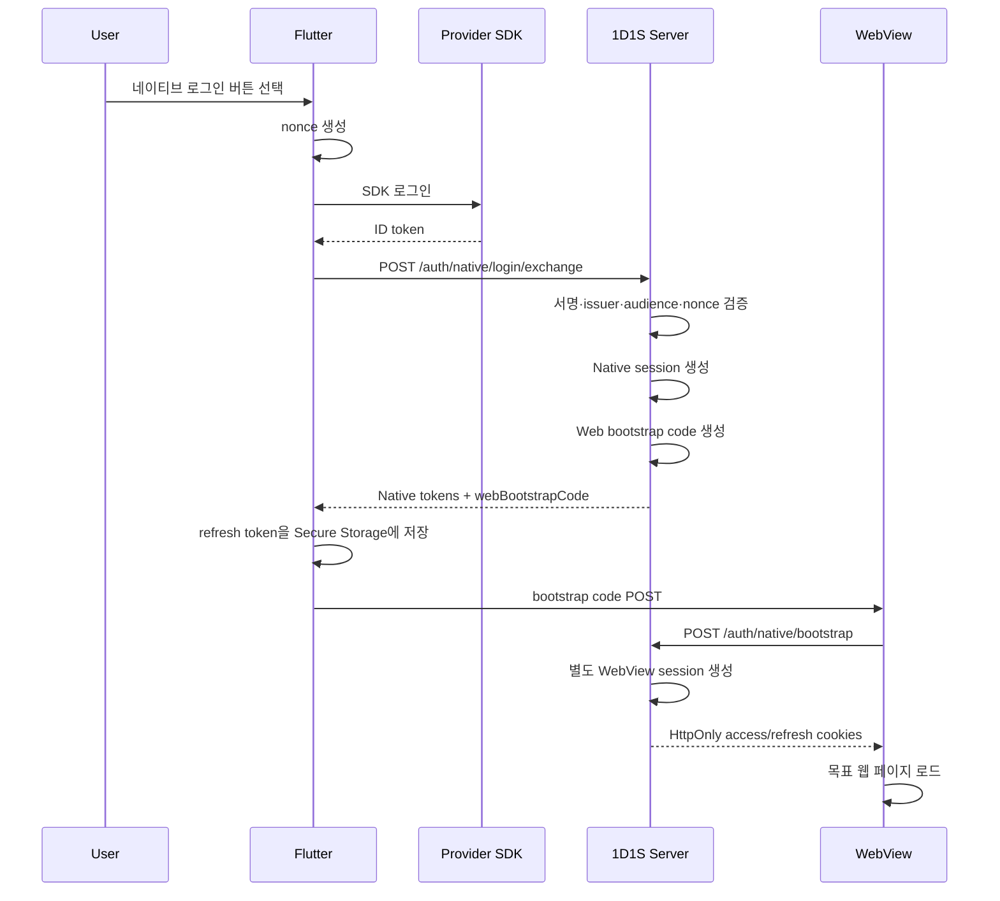
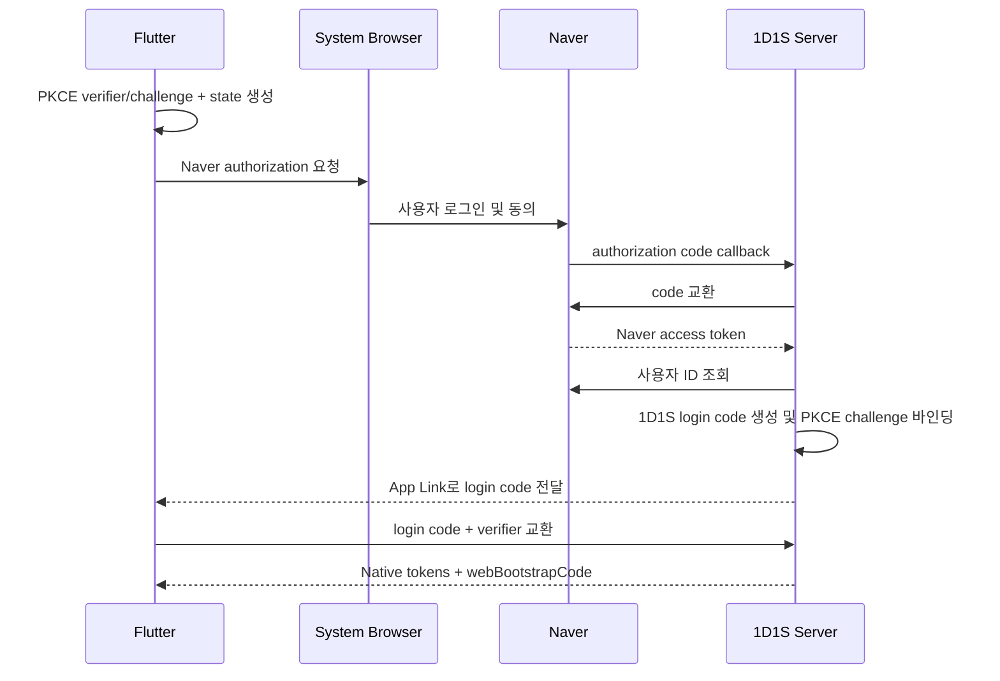

# 1D1S 하이브리드 앱 인증 최종 설계

> 상태: 최종 결정안  
> 대상: `1D1S-server-v2`, `1D1S-client`, `_1d1s_app`  
> 작성일: 2026-07-16

## 1. 목적

1D1S 앱은 대부분의 서비스 화면을 WebView로 제공하되, 성능이 중요하거나 단말 기능 및 앱 설정을 다루는 화면은 Flutter 네이티브 화면으로 구현한다.

이 문서는 다음 요구사항을 동시에 만족하는 인증 구조를 정의한다.

- Flutter 네이티브 화면에서 서버 API를 직접 호출할 수 있어야 한다.
- 여러 WebView에서 기존 Next.js 웹 서비스를 그대로 사용할 수 있어야 한다.
- 앱 실행 중 필요에 따라 WebView를 새로 생성할 수 있어야 한다.
- 네이티브와 WebView의 로그인 상태가 사용자 관점에서 하나처럼 동작해야 한다.
- refresh token rotation 경쟁으로 정상 세션이 폐기되지 않아야 한다.
- 공급자 토큰을 1D1S 세션 토큰처럼 사용하거나 WebView JavaScript에 노출하지 않아야 한다.

## 2. 최종 결론

로그인은 한 번 수행하지만, 로그인 완료 후 다음 두 세션을 독립적으로 발급한다.

| 구분 | Native 세션 | WebView 세션 |
|---|---|---|
| 소비자 | Flutter 네이티브 화면 | Next.js 및 WebView |
| access 전달 | `Authorization: Bearer` | HttpOnly 쿠키 |
| refresh 저장 | Keychain/Keystore | HttpOnly 쿠키 |
| refresh family | Native 전용 | WebView 전용 |
| 갱신 주체 | Flutter API 클라이언트 | Flutter WebView refresh coordinator |

Native와 WebView는 같은 refresh token이나 같은 refresh family를 공유하지 않는다.

동일한 앱 프로필 안의 여러 WebView는 하나의 persistent cookie store와 하나의 WebView 세션을 공유한다. 여러 WebView에서 동시에 발생할 수 있는 refresh 요청은 Flutter가 앱 전역 single-flight로 직렬화한다.

## 3. 전체 구성



## 4. 절대 지켜야 하는 경계

1. Native refresh token을 WebView 쿠키나 JavaScript에 전달하지 않는다.
2. WebView refresh token을 Flutter에서 읽거나 Native API 호출에 사용하지 않는다.
3. Google/Kakao/Naver 토큰을 1D1S access token으로 사용하지 않는다.
4. 공급자 credential은 1D1S 세션 교환이 끝난 후 저장하지 않는다.
5. access token과 refresh token을 토큰 타입 검증 없이 상호 교환해 사용할 수 없게 한다.
6. 일회용 코드를 URL에 붙여 WebView 목표 페이지로 전달하지 않는다. bootstrap endpoint에 POST한다.
7. refresh 요청은 세션 종류별로 single-flight 처리한다.
8. `401`이라고 무조건 refresh하지 않는다. 서버의 만료 오류 코드일 때만 한 번 갱신하고 원 요청을 한 번만 재시도한다.

## 5. 소셜 로그인 전략

### 5.1 Google

Flutter는 Google 로그인 SDK를 사용한다.

- 앱이 서버에 전달하는 credential: Google ID token
- 서버 회원 식별자: Google `sub`
- 서버 검증 항목:
  - Google 공개키 기반 서명
  - `iss`
  - `aud`가 1D1S Google 서버 클라이언트 ID인지 여부
  - `exp`, `iat`
  - 요청 nonce와 ID token nonce의 일치 여부

이메일은 표시 및 초기 프로필 데이터로만 사용한다. 회원의 영구 소셜 식별 키는 `GOOGLE + sub`다.

### 5.2 Kakao

Flutter는 Kakao 공식 Flutter SDK를 사용하고 Kakao OIDC를 활성화한다.

- 앱이 서버에 전달하는 credential: Kakao ID token
- 서버 회원 식별자: Kakao `sub`
- 서버 검증 항목:
  - Kakao JWKS 기반 서명
  - `iss = https://kauth.kakao.com`
  - `aud`가 1D1S Kakao 앱 키인지 여부
  - `exp`, `iat`
  - nonce 일치 여부

Kakao access token으로 사용자 정보 API만 호출해 로그인시키는 방식은 사용하지 않는다.

### 5.3 Naver

Naver는 Google/Kakao와 동일한 OIDC ID token 및 audience 검증 흐름을 제공하지 않으므로 외부 브라우저 Authorization Code + PKCE 방식을 유지한다.

1. Flutter가 `codeVerifier`, `codeChallenge`, `state`를 생성한다.
2. Chrome Custom Tabs 또는 `ASWebAuthenticationSession`으로 Naver 로그인을 연다.
3. Naver authorization code는 서버 callback으로 전달된다.
4. 서버가 client secret을 사용해 code를 교환하고 Naver 사용자 ID를 확인한다.
5. 서버는 provider code 대신 1D1S 전용 일회용 login code를 앱으로 전달한다.
6. Flutter는 login code와 `codeVerifier`를 `/auth/native/login/exchange`에 제출한다.

Naver client secret은 앱 바이너리에 포함하지 않는다.

### 5.4 SDK 실패 시 정책

- SDK 취소: 로그인 전 상태를 유지한다.
- SDK 네트워크 오류: 로그인 화면에 재시도 가능한 오류를 표시한다.
- credential 서버 검증 실패: 공급자 credential과 임시 상태를 즉시 폐기한다.
- 특정 공급자 SDK 장애가 발생해도 다른 공급자의 로그인 경로에는 영향을 주지 않는다.

## 6. 토큰 및 세션 규격

### 6.1 Access token

- 형식: 서명된 JWT
- 권장 만료: 10~15분
- 필수 claim:
  - `sub`: 1D1S member ID
  - `sid`: 1D1S session ID
  - `typ`: `access`
  - `session_type`: `NATIVE` 또는 `WEBVIEW`
  - `aud`: 1D1S API
  - `iat`, `exp`, `jti`
- 민감정보와 공급자 access token을 claim에 포함하지 않는다.

### 6.2 Refresh token

- 목표 형식: 암호학적으로 안전한 256-bit 이상의 opaque random token
- 서버 저장: 원문이 아닌 SHA-256 fingerprint
- Native 저장: `flutter_secure_storage`
- WebView 저장: `HttpOnly`, `Secure` 쿠키
- rotation: 사용할 때마다 이전 토큰 폐기 후 새 토큰 발급
- reuse detection: 이미 회전된 토큰이 다시 제출되면 해당 family를 폐기

현재 JWT refresh token을 사용하는 동안에도 `typ=refresh` 검증과 fingerprint 저장을 유지한다. opaque token 전환은 API 계약을 바꾸지 않고 내부 구현으로 진행할 수 있다.

### 6.3 세션 family

로그인 한 번으로 최소 두 family가 생성된다.

```text
Member 42
├─ Native session
│  └─ family: native-device-A
└─ WebView session
   └─ family: webview-device-A
```

다른 단말은 별도 family를 갖는다. 한 family의 reuse detection이 다른 단말이나 다른 세션 종류까지 폐기하지 않게 한다.

## 7. 로그인 시퀀스

### 7.1 Google/Kakao SDK 로그인



### 7.2 Naver 로그인



App Link/Universal Link를 우선 사용한다. 커스텀 스킴을 유지하는 기간에는 PKCE와 state 검증을 필수로 한다.

## 8. API 계약

### 8.1 Native 로그인 교환

```http
POST /auth/native/login/exchange
Content-Type: application/json
```

Google/Kakao 요청:

```json
{
  "provider": "GOOGLE",
  "credentialType": "ID_TOKEN",
  "credential": "provider-id-token",
  "nonce": "login-request-nonce",
  "deviceId": "installation-id"
}
```

Naver 요청:

```json
{
  "provider": "NAVER",
  "credentialType": "LOGIN_CODE",
  "credential": "1d1s-one-time-login-code",
  "codeVerifier": "pkce-code-verifier",
  "deviceId": "installation-id"
}
```

응답:

```json
{
  "data": {
    "native": {
      "accessToken": "native-access-token",
      "refreshToken": "native-refresh-token",
      "accessTokenExpiresIn": 900,
      "refreshTokenExpiresIn": 2592000
    },
    "webBootstrapCode": "web-bootstrap-code",
    "webBootstrapExpiresIn": 60,
    "profileComplete": true
  }
}
```

`deviceId`는 앱 설치 단위의 임의 UUID이며 광고 ID, IMEI 등 하드웨어 식별자를 사용하지 않는다. 보안 credential이 아니며 세션 목록 표시와 운영 추적에만 사용한다.

### 8.2 Native API 인증

```http
Authorization: Bearer {nativeAccessToken}
```

서버 인증 필터는 반드시 access token 타입, 만료, 서명, `sid`, `session_type`을 검증한다.

### 8.3 Native token refresh

최종 endpoint:

```http
POST /auth/native/token/refresh
Content-Type: application/json

{
  "refreshToken": "native-refresh-token"
}
```

응답:

```json
{
  "data": {
    "accessToken": "new-native-access-token",
    "refreshToken": "new-native-refresh-token",
    "accessTokenExpiresIn": 900,
    "refreshTokenExpiresIn": 2592000
  }
}
```

기존 `/auth/app/token`은 마이그레이션 기간 동안 호환 endpoint로 유지한 후 제거한다.

### 8.4 최초 WebView bootstrap

```http
POST /auth/native/bootstrap
Content-Type: application/json

{
  "code": "web-bootstrap-code"
}
```

성공 시 서버가 새로운 WebView family를 만들고 HttpOnly 쿠키를 설정한다. Native refresh token을 쿠키로 복사하지 않는다.

### 8.5 추가 WebView session code

격리된 WebView에만 사용한다.

```http
POST /auth/native/web-session-code
Authorization: Bearer {nativeAccessToken}
```

```json
{
  "data": {
    "code": "one-time-web-code",
    "expiresInSeconds": 60
  }
}
```

코드는 요청한 회원과 Native session ID에 바인딩하고, 원문 대신 fingerprint를 저장한다.

### 8.6 WebView refresh

최종 endpoint:

```http
POST /auth/web/token/refresh
Cookie: refreshToken=...
```

성공 시 새 access/refresh 쿠키를 함께 설정한다. 기존 `GET /auth/token`은 호환 기간 후 제거한다. 토큰 회전처럼 상태를 변경하는 작업은 최종적으로 GET을 사용하지 않는다.

### 8.7 로그아웃

Native 로그아웃:

```http
POST /auth/native/logout
Authorization: Bearer {nativeAccessToken}

{
  "refreshToken": "current-native-refresh-token"
}
```

WebView 로그아웃:

```http
POST /auth/web/logout
Cookie: refreshToken=...
```

앱의 “로그아웃”은 두 endpoint를 모두 호출한 후 다음 로컬 정리를 수행한다.

1. Native access token 메모리 삭제
2. Secure Storage refresh token 삭제
3. WebView 쿠키 삭제
4. WebView 인증 상태 및 캐시 초기화
5. 모든 WebView를 guest 기준으로 재로드

## 9. Flutter 구현

### 9.1 모듈 구조

```text
lib/
├─ auth/
│  ├─ native_auth_service.dart
│  ├─ native_session_store.dart
│  ├─ social_login_adapter.dart
│  ├─ google_login_adapter.dart
│  ├─ kakao_login_adapter.dart
│  └─ naver_browser_login_adapter.dart
├─ network/
│  ├─ native_api_client.dart
│  ├─ auth_interceptor.dart
│  └─ token_refresh_coordinator.dart
└─ webview/
   ├─ web_session_bootstrapper.dart
   ├─ webview_cookie_store.dart
   └─ webview_refresh_coordinator.dart
```

### 9.2 Native token 저장

- access token: 메모리만 사용
- refresh token: `flutter_secure_storage`
- 앱 재실행:
  1. Secure Storage에서 refresh token 읽기
  2. Native refresh 수행
  3. 새 refresh token을 원자적으로 교체
  4. 실패 시 Native 세션 제거

access token을 SharedPreferences, SQLite, 로그, 분석 이벤트에 기록하지 않는다.

### 9.3 Native API client

- `Dio` 인스턴스는 앱 전역에서 하나만 사용한다.
- 요청 시 메모리의 access token을 Bearer header에 추가한다.
- `AUTH-009`와 같이 access 만료를 명확히 의미하는 오류에서만 refresh한다.
- refresh는 `Future` 하나를 공유하는 single-flight로 처리한다.
- 갱신 후 원 요청은 최대 한 번만 재시도한다.
- refresh 실패 시 무한 재시도하지 않고 Native 세션 만료 상태로 전환한다.

### 9.4 공급자 credential 처리

- SDK credential은 서버 교환 요청이 끝날 때까지만 메모리에 유지한다.
- 디버그 로그에도 전체 credential을 출력하지 않는다.
- Crashlytics, Sentry, analytics payload에 credential을 넣지 않는다.

## 10. WebView 구현

### 10.1 기본 WebView 그룹

홈, 탐색, 챌린지, 일지, 마이페이지 WebView는 같은 persistent cookie store를 사용한다.

- 첫 화면만 앱 시작 시 로드한다.
- 나머지 탭은 최초 진입 시 lazy load한다.
- 한 번 로드된 탭은 가능한 한 alive 상태로 유지한다.
- 로그인 직후 이미 로드된 WebView만 다시 인증 상태로 로드한다.

### 10.2 동적으로 새 WebView를 여는 경우

#### 공유 WebView

기존 persistent cookie store를 사용하는 일반 WebView는 bootstrap 없이 목표 URL을 바로 연다.

```text
create WebView
→ shared cookie store 연결
→ target URL load
```

#### 격리 WebView

임시, 시크릿, 별도 프로필 WebView는 다음 순서를 따른다.

1. Flutter가 Native access token으로 `/auth/native/web-session-code` 요청
2. 격리 WebView가 받은 코드를 `/auth/native/bootstrap`에 POST
3. 해당 WebView 전용 cookie session 생성
4. 목표 URL 로드

격리 WebView를 닫을 때 해당 WebView family를 폐기할 수 있도록 session ID를 추적한다.

### 10.3 WebView refresh 직렬화

모든 WebView의 refresh 요청은 JavaScript bridge를 통해 Flutter coordinator로 전달한다.

```text
WebView A ─┐
WebView B ─┼─ token_refresh request → Flutter single-flight → 서버 1회 호출
WebView C ─┘
```

각 요청 WebView는 같은 완료 결과를 받고 원 요청을 한 번 재시도한다. Native refresh coordinator와 WebView refresh coordinator는 서로 별개다.

## 11. 세션 동기화 및 복구

| Native | WebView | 처리 |
|---|---|---|
| 유효 | 유효 | 정상 진행 |
| 유효 | 만료 | Native access로 새 web session code를 발급해 조용히 재bootstrap |
| 만료 | 유효 | Native 화면 진입 시 재로그인 요구. WebView 쿠키를 Native token으로 변환하지 않음 |
| 만료 | 만료 | 전체 로그인 화면 표시 |
| 폐기/탈퇴 회원 | 일부 유효 | 서버가 모든 세션을 거절하고 앱 전체 로그아웃 |

WebView 인증 상태만 보고 Native token을 새로 발급하는 기능은 초기 범위에 포함하지 않는다. 필요하다면 별도 위협 모델 검토 후 일회용 역방향 handoff로 설계한다.

## 12. 서버 데이터 모델

### 12.1 `auth_session`

| 컬럼 | 설명 |
|---|---|
| `session_id` | UUID 또는 동등한 난수 식별자 |
| `member_id` | 회원 ID |
| `session_type` | `NATIVE`, `WEBVIEW`, `ISOLATED_WEBVIEW` |
| `family_id` | rotation/reuse 폐기 범위 |
| `device_id` | 앱 설치 단위 식별자 |
| `revoked` | 세션 폐기 여부 |
| `revoked_at` | 폐기 시각 |
| `created_at` | 생성 시각 |
| `last_used_at` | 마지막 사용 시각 |

### 12.2 `refresh_token`

| 컬럼 | 설명 |
|---|---|
| `id` | 토큰 레코드 ID |
| `session_id` | 소속 세션 |
| `token_hash` | refresh token SHA-256 fingerprint |
| `status` | `ACTIVE`, `ROTATED`, `REVOKED` |
| `expires_at` | 만료 시각 |
| `rotated_at` | 회전 시각 |
| `replaced_by_id` | 후속 토큰 ID |
| `created_at` | 생성 시각 |

### 12.3 `auth_one_time_code`

| 컬럼 | 설명 |
|---|---|
| `id` | 코드 레코드 ID |
| `member_id` | 회원 ID |
| `purpose` | `NATIVE_LOGIN`, `WEB_BOOTSTRAP` |
| `code_hash` | 코드 SHA-256 fingerprint |
| `pkce_challenge` | Native login에만 사용 |
| `source_session_id` | web code를 발급한 Native session |
| `expires_at` | 만료 시각, 기본 60초 |
| `used_at` | 사용 시각 |
| `created_at` | 생성 시각 |

코드 소비는 pessimistic lock 또는 동등한 원자 연산으로 한 번만 성공해야 한다.

## 13. 쿠키 및 CSRF 정책

WebView 세션은 쿠키 인증이므로 CSRF 방어가 필요하다.

- access/refresh 쿠키: `HttpOnly`, `Secure`, 명시적 `Path`
- 가능한 경우 `SameSite=Lax` 사용
- `SameSite=None`이 필요한 환경에서는 다음을 모두 적용:
  - 허용된 `Origin`/`Referer` 검증
  - CSRF token 적용
  - credential CORS origin allowlist 고정
- bootstrap, refresh, logout은 POST 사용
- refresh cookie의 Path를 가능한 좁게 제한할지 검토

현재 전역 CSRF 비활성화 상태는 최종 구조에서 그대로 유지하지 않는다.

## 14. 오류 코드

| 코드 | 의미 | 클라이언트 처리 |
|---|---|---|
| `AUTH-009` | access token 만료 | 해당 세션 종류의 refresh 1회 |
| `AUTH-006` | refresh token 형식/서명 오류 | 해당 세션 로그아웃 |
| `AUTH-007` | refresh token 만료 | 해당 세션 로그아웃 |
| `AUTH-008` | refresh token 저장소에 없음 | 해당 세션 로그아웃 |
| `AUTH-012` | refresh token reuse 감지 | 해당 family 로그아웃 및 보안 로그 |
| `AUTH-014` | 일회용 코드 무효/이미 사용 | 로그인 또는 bootstrap 재시작 |
| `AUTH-015` | 일회용 코드 만료 | 코드 재발급 |
| `AUTH-016` | provider credential 무효 | 공급자 로그인 재시작 |
| `AUTH-017` | provider audience/nonce 불일치 | 로그인 차단 및 보안 로그 |
| `AUTH-018` | PKCE 검증 실패 | 로그인 차단 및 코드 폐기 |

## 15. 운영 및 보안 로그

다음 이벤트를 credential 원문 없이 기록한다.

- Native/WebView session 생성 및 폐기
- refresh reuse detection
- provider credential 검증 실패 사유 분류
- nonce/state/PKCE 불일치
- 일회용 코드 재사용 시도
- 동일 device에서 비정상적으로 많은 세션 생성
- 회원 탈퇴/정지 후 토큰 사용 시도

로그에 access token, refresh token, provider token, login code 원문을 기록하지 않는다. 필요하면 앞 6자조차 기록하지 않고 별도 fingerprint만 사용한다.

## 16. 레포별 책임

### `1D1S-server-v2`

- 공급자 credential verifier
- Native/WebView session 및 token 발급
- refresh rotation/reuse detection
- 일회용 코드 및 PKCE 검증
- WebView cookie bootstrap
- 세션별 로그아웃과 전체 로그아웃
- CSRF/CORS/Origin 정책

### `_1d1s_app`

- 네이티브 로그인 UI
- Google/Kakao SDK adapter
- Naver 외부 인증 세션
- Native token secure storage
- Native API client와 refresh coordinator
- WebView cookie store 및 bootstrap
- 여러 WebView refresh coordinator
- App Link/Universal Link 처리

### `1D1S-client`

- WebView HttpOnly 쿠키 기반 인증
- Native bridge 메시지 요청/응답
- WebView refresh 요청을 Flutter에 위임
- 로그인 완료 및 로그아웃 상태 UI 동기화
- 토큰 원문을 JavaScript 상태에 저장하지 않음

## 17. 마이그레이션 순서

### Phase 1. 서버 기반 정리

- [x] access/refresh token 타입 검증 분리
- [x] refresh fingerprint 저장
- [x] refresh rotation 및 reuse detection
- [x] WebView 일회용 bootstrap 기반 구현
- [x] session type과 session ID 도입
- [x] Native/WebView family 명시적 분리

### Phase 2. Native 로그인

- [x] Google SDK 도입
- [x] Kakao SDK 및 OIDC 도입
- [x] Naver 외부 OAuth + PKCE 정리
- [x] provider별 서버 verifier 구현
- [x] `/auth/native/login/exchange` 구현
- [ ] nonce/state/PKCE 검증 테스트

### Phase 3. Native API

- [x] `flutter_secure_storage` 도입
- [x] Dio 단일 API client 구현
- [x] Native refresh single-flight 구현
- [x] `/auth/native/token/refresh` 구현
- [x] `/auth/native/logout` 구현

### Phase 4. WebView 세션 완성

- [x] 외부 인증 후 WebView bootstrap
- [x] WebView lazy load
- [x] Flutter 전역 WebView refresh 직렬화
- [x] `/auth/native/web-session-code` 구현
- [ ] 격리 WebView lifecycle 및 세션 폐기
- [x] WebView 세션 자동 복구

### Phase 5. 보안 강화 및 레거시 제거

- [x] Web cookie CSRF 방어
- [ ] App Link/Universal Link 적용
- [ ] refresh token opaque 전환
- [ ] `GET /auth/token` 제거
- [ ] `/auth/app/token` 제거
- [ ] provider access token 직접 로그인 코드가 남아 있지 않은지 확인

## 18. 테스트 및 완료 조건

### 서버

- access token을 refresh endpoint에 사용할 수 없다.
- refresh token을 API access token으로 사용할 수 없다.
- provider ID token의 audience가 다르면 로그인이 실패한다.
- nonce/state/PKCE가 다르면 로그인이 실패한다.
- 같은 일회용 코드는 동시 요청에서도 한 번만 성공한다.
- Native와 WebView refresh family가 다르다.
- Native refresh reuse가 WebView 세션을 폐기하지 않는다.
- WebView refresh reuse가 Native 세션을 폐기하지 않는다.

### Flutter

- 앱 재실행 후 Secure Storage refresh token으로 Native 세션을 복원한다.
- 동시 Native API 401이 발생해도 refresh 요청은 한 번만 전송된다.
- 여러 WebView에서 동시에 refresh를 요청해도 서버 요청은 한 번만 전송된다.
- provider credential과 1D1S token이 로그에 출력되지 않는다.
- 로그아웃 후 Secure Storage와 WebView cookie가 모두 제거된다.

### WebView

- 기본 WebView들은 로그인 쿠키를 공유한다.
- 새 공유 WebView는 bootstrap 없이 인증 페이지를 연다.
- 격리 WebView는 일회용 코드로만 로그인한다.
- JavaScript에서 Native/WebView refresh token을 읽을 수 없다.
- refresh 실패 시 무한 재시도하지 않는다.

## 19. 최종 의사결정 요약

1. 앱의 로그인 화면은 Flutter 네이티브로 구현한다.
2. Google과 Kakao는 SDK와 OIDC ID token을 사용한다.
3. Naver는 외부 브라우저 Authorization Code + PKCE를 사용한다.
4. 로그인 완료 후 Native Bearer 세션과 WebView HttpOnly 쿠키 세션을 별도로 만든다.
5. Native access token은 메모리, Native refresh token은 Keychain/Keystore에 저장한다.
6. 기본 WebView들은 하나의 cookie store와 WebView session을 공유한다.
7. 격리 WebView만 별도 일회용 코드로 bootstrap한다.
8. Native refresh와 WebView refresh는 각각 앱 전역 single-flight로 처리한다.
9. 공급자 credential과 1D1S 세션 token을 서로 대체해 사용하지 않는다.
10. 로그아웃은 Native와 WebView 세션을 모두 폐기한다.

이 문서를 기준으로 API와 클라이언트 구현을 진행하며, 다른 인증 흐름을 추가하려면 Native/WebView 세션 경계와 refresh family 분리 원칙을 먼저 검토한다.
